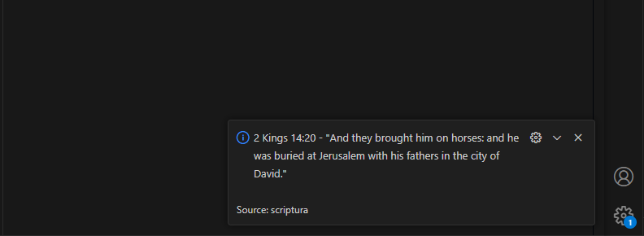
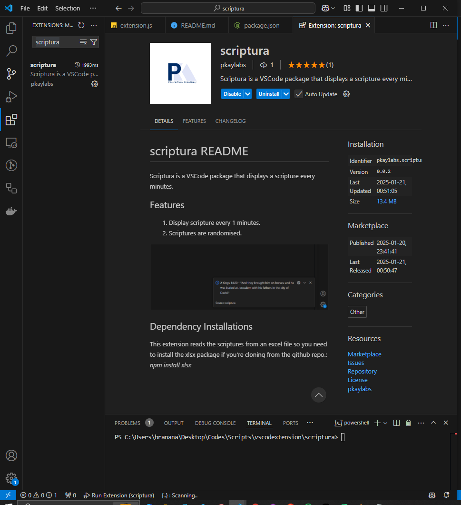

# scriptura README
Scriptura is a VSCode extension that displays a scripture every minutes.

## Features
1. Display scripture every 1 minutes.
2. Scriptures are randomised.

## Clone Repository
_git clone https://github.com/DevPrinceK/scriptura.git_

## Dependency Installations
This extension reads the scriptures from an excel file so you need to install the xlsx package if you're cloning from the github repo.: _npm install xlsx_